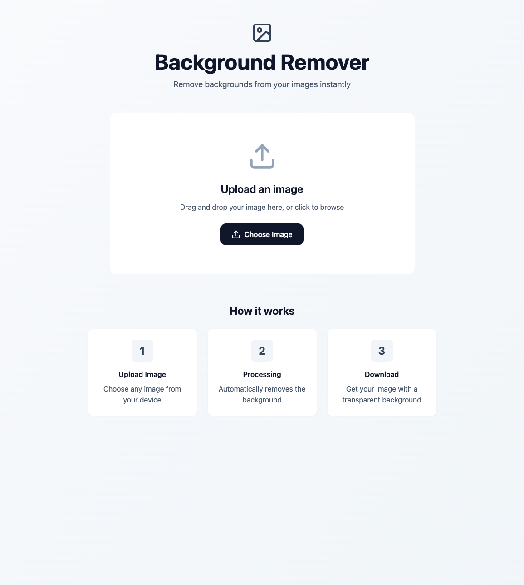
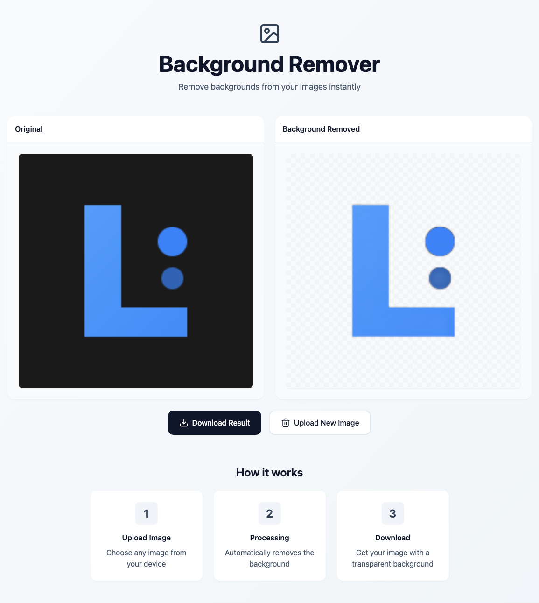

# Background Remover

Fast React + Vite interface for stripping backgrounds out of user-uploaded images via `@imgly/background-removal`. Drag-and-drop or browse for a file, preview the original and processed versions side-by-side, and download the transparent PNG.




## Features
- Zero-config drag-and-drop uploader with progress feedback.
- Client-side background removal powered by `@imgly/background-removal`.
- Instant preview of original vs. processed image with download-ready PNG.
- Responsive Tailwind UI designed for desktop and tablet breakpoints.

## Getting Started
1. **Install dependencies**
   ```bash
   npm install
   ```
2. **Run the dev server**
   ```bash
   npm run dev
   ```
   Vite serves the app at http://localhost:5173 with hot reload.
3. **Build for production**
   ```bash
   npm run build
   npm run preview  # optional sanity check of dist/ bundle
   ```

## Usage
1. Open the app and drop an image into the uploader (or click **Choose Image**).
2. Wait for the loader to finish while `removeBackground` processes the file entirely in the browser.
3. Compare the previews and click **Download Result** to save `background-removed.png`.
4. Use **Upload New Image** to reset the canvas.

## Project Structure
- `src/App.tsx` — main UI flow, drag handlers, processing logic, download/reset controls.
- `src/main.tsx` — React root + Tailwind/global styles import.
- `src/index.css` — Tailwind directives and project-wide styles.
- `public/index.html` (generated by Vite) — mounting root.
- `screenshots/` — marketing screenshots referenced above.

## Development Scripts
- `npm run dev` — Vite dev server with hot-module reload.
- `npm run build` — Production bundle in `dist/`.
- `npm run preview` — Serves `dist/` locally.
- `npm run lint` — ESLint check for JSX/TS/Tailwind best practices.
- `npm run typecheck` — TypeScript `--noEmit` verification.

## Technologies
- [React 18](https://react.dev/) for UI.
- [Vite 5](https://vitejs.dev/) for dev/build pipeline.
- [TypeScript](https://www.typescriptlang.org/) for type safety.
- [Tailwind CSS](https://tailwindcss.com/) for styling.
- [lucide-react](https://lucide.dev/) for icons.
- [@imgly/background-removal](https://www.npmjs.com/package/@imgly/background-removal) for on-device background extraction.
